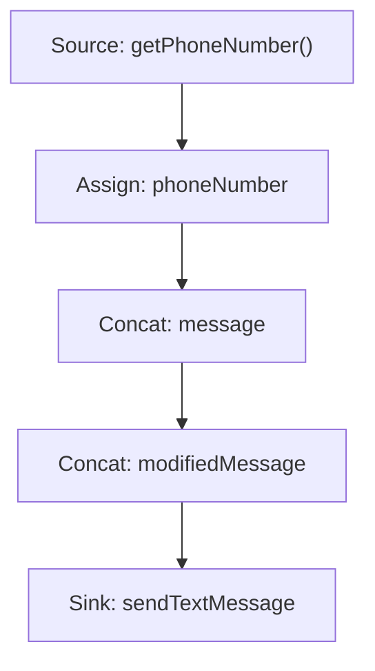
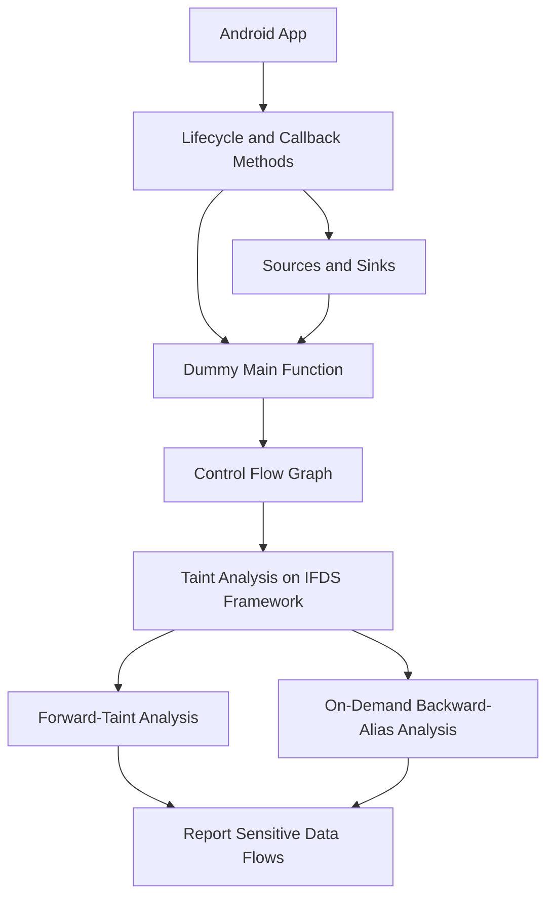
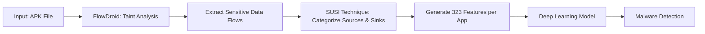
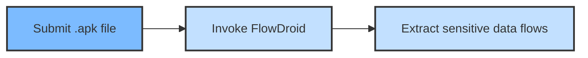
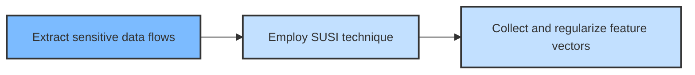
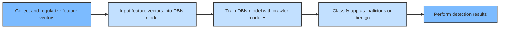
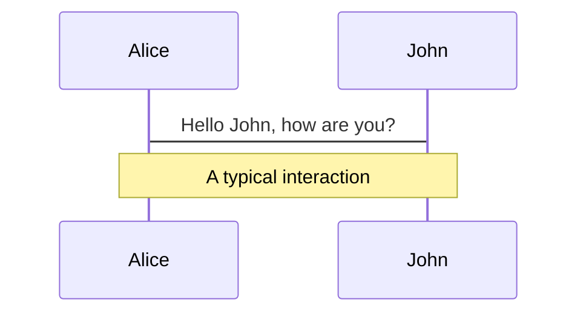
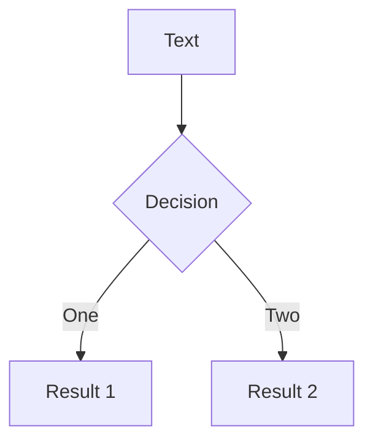
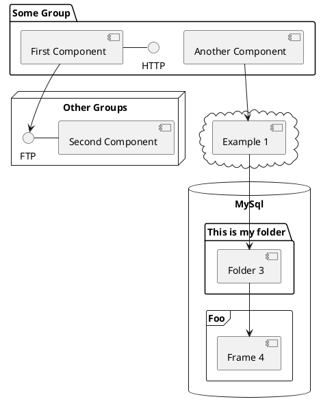

## DeepFlow: Deep Learning-Based Malware Detection by Mining Android Application for Abnormal Usage of Sensitive Data

By 

Sourena Khanzadeh

<!-- <div class="pt-12">
  <span @click="$slidev.nav.next" class="px-2 py-1 rounded cursor-pointer" hover="bg-white bg-opacity-10">
    Press Space for next page <carbon:arrow-right class="inline"/>
  </span>
</div>

<div class="abs-br m-6 flex gap-2">
  <button @click="$slidev.nav.openInEditor()" title="Open in Editor" class="text-xl slidev-icon-btn opacity-50 !border-none !hover:text-white">
    <carbon:edit />
  </button>
  <a href="https://github.com/slidevjs/slidev" target="_blank" alt="GitHub"
    class="text-xl slidev-icon-btn opacity-50 !border-none !hover:text-white">
    <carbon-logo-github />
  </a>
</div> -->

<!--
The last comment block of each slide will be treated as slide notes. It will be visible and editable in Presenter Mode along with the slide. [Read more in the docs](https://sli.dev/guide/syntax.html#notes)
-->

---
transition: fade-out
---

# Table of Contents

Here is the summary and structure of the presentation.

- 📝 Abstract
- 🎥 Introduction
- 📖 Background
- 📚 Literature Review **(Not Provided)**
- 📊 Methodology
- 📉 Evaluation
- 🔚 Conclusion

<br>
<br>

Visit the presentation https://sourenakhanzadeh.github.io/DeepFlow/

Read more about [Paper.](https://github.com/sourenaKhanzadeh/DeepFlow)

<!--
You can have `style` tag in markdown to override the style for the current page.
Learn more: https://sli.dev/guide/syntax#embedded-styles
-->

<style>
h1 {
  background-color: #2B90B6;
  background-image: linear-gradient(45deg, #4EC5D4 10%, #146b8c 20%);
  background-size: 100%;
  -webkit-background-clip: text;
  -moz-background-clip: text;
  -webkit-text-fill-color: transparent;
  -moz-text-fill-color: transparent;
}
</style>

<!--
Itroduce the project presentation
-->

---
transition: slide-up
---

# Abstract

Short summary of the paper.

### Keywords: <kbd>key</kbd>

The open nature of Android allows application developers to take full advantage of the system. While the flexibility is brought to developers and users, it may raise significant issues related to malicious applications. Traditional malware detection approaches based on signatures or abnormal behaviors are invalid when dealing with novel malware. To solve the problem, machine learning algorithms are used to learn the distinctions between malware and benign apps automatically. Deep learning, as a new area of machine learning, is developing rapidly as its better characterization of samples. We thus propose <kbd>DeepFlow</kbd>, a novel deep learning-based approach for identifying malware directly from the data flows in the Android application. We test <kbd>DeepFlow</kbd> on thousands of <kbd>benignware</kbd> and <kbd>malware</kbd>. The results show that <kbd>DeepFlow</kbd> can achieve a high detection <kbd>F1</kbd> score of 95.05%, outperforming traditional machine learning-based approaches, which reveals the advantage of deep learning technique in malware detection.

<!-- https://sli.dev/guide/animations.html#click-animations -->
<!-- 
<p v-after class="absolute bottom-23 left-45 opacity-30 transform -rotate-10">Here!</p> -->

---
layout: image-right
image: https://source.unsplash.com/collection/94734566/1920x1080
---

# Introduction
What is the problem?

<small>
  <ul>
    <li>Android devices have seen a rapid increase in popularity, with over 1.6 billion shipments in 2016 (Gartner, 2016).</li>
    <li>This popularity has led to the development of a vast Android application market with millions of apps available for download.</li>
    <li>However, due to the open nature of the Android platform, these markets are vulnerable to malware attacks (Sensor Tower, 2016).</li>
    <li>Malicious apps treat sensitive data differently from benign apps and can steal sensitive data, making it important to detect such apps.</li>
    <li>Previous approaches such as dynamic taint analysis have proven to be ineffective in detecting all sensitive data flows.</li>
  </ul>
</small>


<style>
.footnotes-sep {
  @apply mt-20 opacity-10;
}
.footnotes {
  @apply text-sm opacity-75;
}
.footnote-backref {
  display: none;
}
</style>

---
layout: image-left
image: https://source.unsplash.com/collection/94734566/1920x1080
transition: slide-up
---
# Introduction (cont.)
What is the solution?

<small>
  <ul>
    <li>Introducing <kbd>DeepFlow</kbd> a new Android malware detection tool that utilizes deep learning algorithms to detect and classify malware apps based on their data flow features.</li>
    <li>
      Deep learning algorithms can model high-level abstractions in data by using a deep graph with multiple processing layers.
    </li>
    <li>
      DeepFlow uses <kbd>FlowDroid</kbd> to extract data flows from thousands of benign and malicious apps and then applies <kbd>SUSI</kbd> technique to transform the feature granularity from method level to category level.
    </li>
    <li>
    A deep learning model is constructed using the extracted data flow features to automatically flag apps with suspicious data flow features.
    </li>
  </ul>
</small>

---
transition: slide-up
layout: two-cols
---

# Background

Taint Analysis

1. Sensitive Source (Source of user's sensitive information)
  ```java
  String phoneNumber = getPhoneNumber();
  ```
2. Taint Analysis (Track sensitive data throughout the code)
  ```java
  String message = "Phone Number: " + phoneNumber;
  String modifiedMessage = message + ", info.";
  ```
3. Sensitive Sink (Potential data leak point)
  ```java
  sendTextMessage(phoneNumber, modifiedMessage);
  ```

::right::



---
transition: slide-down
---

# Background (cont.)
Deep Learning

- Deep learning is a subset of machine learning that models high-level abstractions in data.
- It uses multiple processing layers with linear and non-linear transformations.

```python{all|1-4|6-13|15-19|all}
def initialize_network(input_size, hidden_size, output_size):
    network = create_network_structure(input_size, hidden_size, output_size)
    initialize_weights(network)
    return network

def train_network(network, training_data, learning_rate, epochs):
    for epoch in range(epochs):
        for data, target in training_data:
            input = preprocess_data(data)
            output = forward_pass(network, input)
            loss = calculate_loss(output, target)
            gradients = backpropagate(network, loss)
            update_weights(network, gradients, learning_rate)

def predict(network, input_data):
    input = preprocess_data(input_data)
    output = forward_pass(network, input)
    prediction = interpret_output(output)
    return prediction
```
---
transition: slide-right
---
# Background (cont.)
Traditional Approaches

- Require manual feature engineering.
- Often less accurate with large datasets.
- May struggle with unstructured data.

```python{all|1-3|5-9|11-14|all}
def preprocess_data(data):
    engineered_features = extract_manual_features(data)
    return engineered_features

def train_model(training_data, model_type, model_params):
    model = create_model(model_type, model_params)
    features, targets = separate_features_and_targets(training_data)
    model.fit(features, targets)
    return model

def predict(model, input_data):
    input_features = preprocess_data(input_data)
    prediction = model.predict(input_features)
    return prediction

```
---
transition: slide-left
---

# Background (cont.)
Deep Learning vs Traditional Approaches

<table class="small-font" style="width: 100%;height:250px;font-size:small">
  <tr>
    <th>Feature</th>
    <th>Traditional Approaches</th>
    <th>Deep Learning</th>
  </tr>
  <tr>
    <td>Feature Engineering</td>
    <td>Manual</td>
    <td>Automatic</td>
  </tr>
  <tr>
    <td>Performance with Large Datasets</td>
    <td>Often Less Accurate</td>
    <td>More Accurate</td>
  </tr>
  <tr>
    <td>Handling Unstructured Data</td>
    <td>May Struggle</td>
    <td>Better</td>
  </tr>
  <tr>
    <td>Model Complexity</td>
    <td>Generally Simpler</td>
    <td>More Complex (multiple layers)</td>
  </tr>
  <tr>
    <td>Training Time</td>
    <td>Often Faster</td>
    <td>Can be Slower (depends on model)</td>
  </tr>
  <tr>
    <td>Interpretability</td>
    <td>Generally More Interpretable</td>
    <td>Less Interpretable</td>
  </tr>
  <tr>
    <td>Applicability to Various Domains</td>
    <td>Domain-specific Feature Engineering</td>
    <td>More Adaptable to Different Domains</td>
  </tr>
</table>


<style>
.small-font {
  font-size: small;
}
table {
  font-family: Arial, sans-serif;
  border-collapse: collapse;
  width: 100%;
}
td, th {
  border: 1px solid #dddddd;
  text-align: left;
  padding: 8px;
}
tr:nth-child(even) {
  background-color: #f2f2f2;
}
</style>
---
transition: slide-up
---
# Literature Review 
Motivation

[Y uan, Z., Lu, Y ., Xue, Y .: Droiddetector: android malware characterization and detection using deep learning. Tsinghua Science and Technology, 21(1), 114-123 (2016)](https://ieeexplore.ieee.org/stamp/stamp.jsp?arnumber=7399288)

[Yuan, Z., Lu, Y., Wang, Z., & Xue, Y. (2014, August). Droid-sec: deep learning in android malware detection. In Proceedings of the 2014 ACM conference on SIGCOMM (pp. 371-372).](https://dl.acm.org/doi/pdf/10.1145/2619239.2631434)

[Deep Instinct](https://www.deepinstinct.com)

---
transition: slide-left
layout: two-cols
---

# Proposed Methodology
Taint Analysis FlowDroid
<Transform :scale="0.45">

1. Why FlowDroid?
  - Fully context, flow, field, and object-sensitive.
  - Precisely models the Android lifecycle, including user-defined UI widgets.
2. Analyzing Android App Components:
  - No main function in an Android app.
  - Components have lifecycle methods (e.g., onCreate(), onStart(), onDestroy()) and various callbacks.
  - FlowDroid builds a control flow graph by modeling component lifecycles.
3. Building the Control Flow Graph:
  - FlowDroid identifies lifecycle and callback methods, as well as calls to sources and sinks.
  - Creates a dummy main function to simulate interactions among event handlers and components.
  - The dummy main function serves as the exclusive entrance of the Android app, simplifying the analysis process.
4. Taint Analysis on [IFDS Framework](https://pages.cs.wisc.edu/~fischer/cs701.f14/popl95.pdf):
  - FlowDroid formalizes data flow analysis as a taint analysis.
  - Each sensitive source is treated as a starting point for the taint analysis process.
  - Combines forward-taint analysis and on-demand backward-alias analysis.
5. Reporting Sensitive Data Flows:
  - FlowDroid reports all discovered flows from sensitive sources to sinks in the app.

</Transform>

::right::

<Transform :scale="0.9">

</Transform>


---
transition: slide-left
---
# Proposed Methodology (cont.)
Feature Extraction

- DeepFlow uses FlowDroid to extract sensitive data flows
- FlowDroid is context-sensitive and can distinguish different calls
- Features extracted from both benign and malicious apps
- SUSI technique used for categorizing source and sink methods

<div class="chart">

</div>

<style>
.chart {
  width: 100%;
  margin: 100px auto;
}
</style>

---
transition: slide-left
preload: false
---

# Proposed Methodology (cont.)
Feature Extraction on Single App

- Analyze the Android app installation file (apk)
- Extract sensitive data flows using FlowDroid
- Example: Location data leaked via SMS
- Complex paths between source and sink in real-world malware


<div class="icons">
  <svg v-click="1" 
   v-motion-slide-visible-once-left
  xmlns="http://www.w3.org/2000/svg" width="256" height="145" viewBox="0 0 256 145"><path fill="#3DDC84" d="m190.736 43.58l21.305-36.927a4.443 4.443 0 0 0-1.623-6.06a4.436 4.436 0 0 0-6.055 1.625l-21.57 37.395C166.294 32.079 147.768 27.882 128 27.882s-38.297 4.197-54.792 11.731L51.637 2.217A4.437 4.437 0 0 0 45.581.593a4.44 4.44 0 0 0-1.622 6.06L65.264 43.58C28.681 63.494 3.66 100.56 0 144.35h256c-3.663-43.79-28.685-80.856-65.264-100.77m-3.921 42.95c5.828 0 10.568 4.829 10.568 10.764c0 5.937-4.74 10.769-10.568 10.769c-5.826 0-10.566-4.832-10.566-10.769c0-5.935 4.74-10.764 10.566-10.764Zm-117.631 0c5.826 0 10.567 4.829 10.567 10.764c0 5.937-4.741 10.769-10.567 10.769c-5.828 0-10.567-4.832-10.567-10.769c0-5.935 4.74-10.764 10.567-10.764Z"/></svg>

<svg 
 v-motion-slide-visible-once-left
v-click="2" xmlns="http://www.w3.org/2000/svg" width="256" height="145" viewBox="0 0 24 24"><g fill="none" stroke="currentColor" stroke-linecap="round" stroke-linejoin="round" stroke-width="2"><path d="M20 11a8.1 8.1 0 0 0-6.986-6.918A8.095 8.095 0 0 0 4.995 8M4 13a8.1 8.1 0 0 0 15 3"/><path d="M18 16a1 1 0 1 0 2 0a1 1 0 1 0-2 0M4 8a1 1 0 1 0 2 0a1 1 0 1 0-2 0m5 4a3 3 0 1 0 6 0a3 3 0 1 0-6 0"/></g></svg>

<svg v-click="3" 
   v-motion-slide-visible-once-left
xmlns="http://www.w3.org/2000/svg" width="256" height="145" viewBox="0 0 512 512"><path fill="currentColor" d="M279.816 85.93L269.3 100.465l28.06 27.111l8.694-16.3zm-21.175 29.267l-42.282 58.436l37.246 35.984l34.946-65.525zM153.455 137.9l-46.816 29.192L306.46 360.15c4.08-1.929 8.605-3.15 13.539-3.15c3.881 0 7.508.76 10.867 2.02l-1.55-1.499l12.503-12.945L354.682 357l-10.268 10.63c4.31 3.924 8.02 8.35 11.486 12.745l11.077-11.465l12.859 12.426l-12.508 12.945c3.62 4.436 8.724 9.265 13.916 10.43l10.908-11.293l5.016 4.846c3.702-3.574 7.58-8.457 11.63-13.664zm-98.623 4.168c-4.078 8.773-3.407 19.566-.8 32.7c3.406 17.167 10.435 36.207 10.222 54.75c-.075 6.474-1.264 12.54-2.803 18.23l116.563 112.615C182.208 358.31 186.885 357 192 357c9.367 0 17.28 4.373 23.41 9.713c6.13 5.34 11.027 11.762 15.694 17.762c4.666 6 9.103 11.577 13.306 15.238c4.203 3.66 7.623 5.287 11.59 5.287c3.967 0 7.387-1.627 11.59-5.287s8.64-9.238 13.306-15.238c3.429-4.408 6.985-9.042 11.06-13.309zm106.947 28.569l12.862 12.425l-12.508 12.946l-12.862-12.426zm208.06 2.263l-10.517 14.536l28.059 27.109l8.693-16.299zM187.5 195.486l12.86 12.424l-12.504 12.945l-12.86-12.423zm161.165 6.682l-42.283 58.436l37.246 35.982l34.945-65.524zM213.22 220.334l12.861 12.424l-12.504 12.945l-12.861-12.424zm25.722 24.85l12.86 12.423l-12.508 12.946l-12.86-12.424zm221.084 15.191l-10.517 14.537l28.06 27.11l8.694-16.301zM55.56 267.084a66.9 66.9 0 0 0-.627 2.52c-2.532 11.232-2.865 18.802 7.882 29.185l89.479 86.453c.203-.26.4-.506.603-.767c3.338-4.292 6.802-8.794 10.743-12.967zm209.103 2.947l12.86 12.424l-12.508 12.945l-12.86-12.423zm174.188 19.612l-42.145 58.246l23.654 22.855a68.962 68.962 0 0 1 4.23-4.031c6.13-5.34 14.044-9.713 23.41-9.713c.082 0 .162.005.244.006l20.516-38.469zm-148.467 5.236l12.86 12.426l-12.509 12.945l-12.859-12.426zm25.72 24.85l12.86 12.423l-12.508 12.946l-12.86-12.424zM64 375c-19.807 5.72-33.274 18.147-46 31.898v30.579l.01-.006C31.525 428.62 47.7 419 64 419s27.881 10.654 37.842 19.154C111.802 446.654 120.144 453 128 453c7.856 0 16.197-6.346 26.158-14.846C164.12 429.654 175.7 419 192 419c16.3 0 27.881 10.654 37.842 19.154C239.802 446.654 248.144 453 256 453c7.856 0 16.197-6.346 26.158-14.846C292.12 429.654 303.7 419 320 419c16.3 0 27.881 10.654 37.842 19.154C367.802 446.654 376.144 453 384 453c7.856 0 16.197-6.346 26.158-14.846C420.12 429.654 431.7 419 448 419c16.3 0 32.475 9.62 45.99 18.47l.01.007v-30.578c-9.969-10.693-33.06-31.31-46-31.899c-3.967 0-7.387 1.627-11.59 5.287C419.78 396.286 407.425 422.591 384 423c-27.151-1.916-36.8-28.488-52.41-42.713c-4.203-3.66-7.623-5.287-11.59-5.287c-3.967 0-7.387 1.627-11.59 5.287C291.78 396.286 279.425 422.591 256 423c-27.151-1.916-36.8-28.488-52.41-42.713c-4.203-3.66-7.623-5.287-11.59-5.287c-3.967 0-7.387 1.627-11.59 5.287C163.78 396.286 151.425 422.591 128 423c-27.151-1.916-36.8-28.488-52.41-42.713C71.387 376.627 67.967 375 64 375zm0 62c-18.195 3.791-32.267 12.364-46 22.385V494h476v-34.615c-11.752-8.054-32.671-21.938-46-22.385c-24.766 6.02-41.304 33.45-64 34c-23.532 2.01-46.008-36.297-64-34c-25.282 3.227-41.304 33.45-64 34c-23.532 2.01-46.008-36.297-64-34c-25.282 3.227-41.304 33.45-64 34c-23.532 2.01-45.87-33.455-64-34z"/></svg>
</div>

<style>
.icons {
  position: relative;
  width: 100%;
  height: 100%;
  margin: 100px auto;
  display: flex;
  justify-content: center;
}
</style>

<script setup lang="ts">
const final = {
  x: 0,
  y: 0,
  rotate: 0,
  scale: 1,
  transition: {
    type: 'spring',
    damping: 10,
    stiffness: 20,
    mass: 2
  }
}
</script>
---
transition: slide-left
---

# Proposed Methodology (cont.)
FlowDroid Data Flow Analysis Steps

- Variables from the source are tainted and propagated
- Formal arguments in callee method are tainted
- Track and taint aliases of arguments
- Return value is mapped back into the caller
- Sink of the location is recognized


<style>
img {
  position: absolute;
  top: 0;
  right: 0;
}
</style>

---
transition: slide-left
---

# Proposed Methodology (cont.)
Malicious and Benign Apps

- 3,000 benign apps from Google Play Store
- 8,000 malicious apps from Android Malware Genome Project and VirusShare
- Benign apps represent "normal" usage of sensitive data
- Malicious apps reveal "abnormal" usage of sensitive data

---
transition: slide-left
---

# Proposed Methodology (cont.)
Feature Granularity

- FlowDroid extracts full source and sink method names
- SUSI technique used for categorizing source and sink methods
- 17 source categories and 19 sink categories
- 323 features obtained for each app


---
transition: slide-up
---

# Proposed Methodology (cont.)
SUSI Technique

<div class="susi">
<ul>
  <li>SUSI is an automated machine learning guided approach for identifying sources and sinks directly from the code of an Android API.
  </li>
  <li>Classifies the identified sources and sinks into 17 source categories and 19 sink categories, revealing the additional information on what information has leaked where.
  </li>
  <li>Combined with FlowDroid, SUSI helps obtain 323 features for each app, transforming the feature granularity from method level to category level.
  </li>
  <li>Results in a more manageable and less sparse feature vector, making it more suitable for deep learning model training.
  </li>
</ul>


</div>

<style>
.susi {
  position: relative;
  width: 100%;
  height: 100%;
  display: flex;
  font-size: 0.6em;
  justify-content: center;
}
img{
  height:80%;
}
</style>
---
transition: slide-left
layout: two-cols
---

# Proposed Methodology (cont.)
Automatic Classification by Deep Learning

<Transform :scale="0.55">
DeepFlow leverages differences and similarities in data flows within malicious and benign apps to automatically identify novel apps as malicious or not using a deep learning model. We use Deep Belief Networks (DBN) to construct DeepFlow.

## Deep Belief Networks (DBN)

DBN is a type of deep neural network composed of multiple layers of latent variables (hidden units named RBM) with connections between the layers but not between units within each layer. RBM layers in a DBN act as feature detectors to learn probabilistically reconstructing the feature vectors, which gradually evolve high-level representations.

## Training and Fine-tuning DBN

DBN training occurs in two phases:

1. Unsupervised training on a set of unlabeled app samples to learn high-level representations.
2. Supervised training with labeled app samples to perform classification and fine-tuning for improved accuracy.
</Transform>
::right::

<Transform :scale="0.6">

## DeepFlow Implementation

DeepFlow follows these steps:

1. Invoke FlowDroid to execute static data flow analysis and extract sensitive data flows from submitted .apk file.
2. Employ SUSI technique to categorize extracted flows and get features.
3. Collect and regularize feature vectors.
4. Input feature vectors into the DBN deep learning model for classification.
5. Train the DBN model based on crawler modules for malware (from sources like Genome, VirusTotal, and Drebin) and benignware (from the Google Play Store).
6. Perform detection results, including detailed sensitive data flow information and actual classification of the app.

DeepFlow can ensure its accuracy in detecting constantly emerging novel malware by continuously updating its training data from malware and benignware sources.

</Transform>

---
transition: slide-left
---

# Proposed Methodology (cont.)
DeepFlow as a Whole

Data Flow Extraction


Feature Extraction


Deep Learning and Classification


---

# Components

<div grid="~ cols-2 gap-4">
<div>

You can use Vue components directly inside your slides.

We have provided a few built-in components like `<Tweet/>` and `<Youtube/>` that you can use directly. And adding your custom components is also super easy.

```html
<Counter :count="10" />
```

<!-- ./components/Counter.vue -->
<Counter :count="10" m="t-4" />

Check out [the guides](https://sli.dev/builtin/components.html) for more.

</div>
<div>

```html
<Tweet id="1390115482657726468" />
```

<Tweet id="1390115482657726468" scale="0.65" />

</div>
</div>

<!--
Presenter note with **bold**, *italic*, and ~~striked~~ text.

Also, HTML elements are valid:
<div class="flex w-full">
  <span style="flex-grow: 1;">Left content</span>
  <span>Right content</span>
</div>
-->


---
class: px-20
---

# Themes

Slidev comes with powerful theming support. Themes can provide styles, layouts, components, or even configurations for tools. Switching between themes by just **one edit** in your frontmatter:

<div grid="~ cols-2 gap-2" m="-t-2">

```yaml
---
theme: default
---
```

```yaml
---
theme: seriph
---
```


</div>

Read more about [How to use a theme](https://sli.dev/themes/use.html) and
check out the [Awesome Themes Gallery](https://sli.dev/themes/gallery.html).

---
preload: false
---

# Animations

Animations are powered by [@vueuse/motion](https://motion.vueuse.org/).

```html
<div
  v-motion
  :initial="{ x: -80 }"
  :enter="{ x: 0 }">
  Slidev
</div>
```

<div class="w-60 relative mt-6">
  <div class="relative w-40 h-40">
    
    
    
  </div>

  <div
    class="text-5xl absolute top-14 left-40 text-[#2B90B6] -z-1"
    v-motion
    :initial="{ x: -80, opacity: 0}"
    :enter="{ x: 0, opacity: 1, transition: { delay: 2000, duration: 1000 } }">
    Slidev
  </div>
</div>

<!-- vue script setup scripts can be directly used in markdown, and will only affects current page -->
<script setup lang="ts">
const final = {
  x: 0,
  y: 0,
  rotate: 0,
  scale: 1,
  transition: {
    type: 'spring',
    damping: 10,
    stiffness: 20,
    mass: 2
  }
}
</script>

<div
  v-motion
  :initial="{ x:35, y: 40, opacity: 0}"
  :enter="{ y: 0, opacity: 1, transition: { delay: 3500 } }">

[Learn More](https://sli.dev/guide/animations.html#motion)

</div>

---

# LaTeX

LaTeX is supported out-of-box powered by [KaTeX](https://katex.org/).

<br>

Inline $\sqrt{3x-1}+(1+x)^2$

Block
$$
\begin{array}{c}

\nabla \times \vec{\mathbf{B}} -\, \frac1c\, \frac{\partial\vec{\mathbf{E}}}{\partial t} &
= \frac{4\pi}{c}\vec{\mathbf{j}}    \nabla \cdot \vec{\mathbf{E}} & = 4 \pi \rho \\

\nabla \times \vec{\mathbf{E}}\, +\, \frac1c\, \frac{\partial\vec{\mathbf{B}}}{\partial t} & = \vec{\mathbf{0}} \\

\nabla \cdot \vec{\mathbf{B}} & = 0

\end{array}
$$

<br>

[Learn more](https://sli.dev/guide/syntax#latex)

---

# Diagrams

You can create diagrams / graphs from textual descriptions, directly in your Markdown.

<div class="grid grid-cols-3 gap-10 pt-4 -mb-6">







</div>

[Learn More](https://sli.dev/guide/syntax.html#diagrams)

---
src: ./pages/multiple-entries.md
hide: false
---

---
layout: center
class: text-center
---

# Learn More

[Documentations](https://sli.dev) · [GitHub](https://github.com/slidevjs/slidev) · [Showcases](https://sli.dev/showcases.html)
