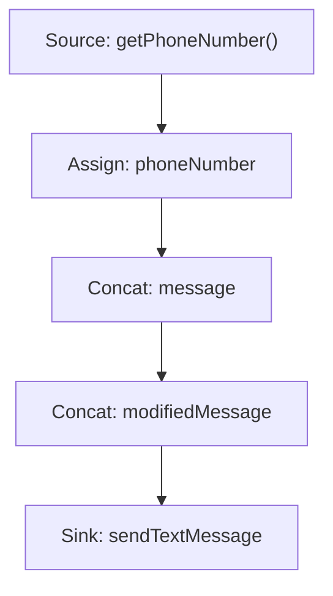
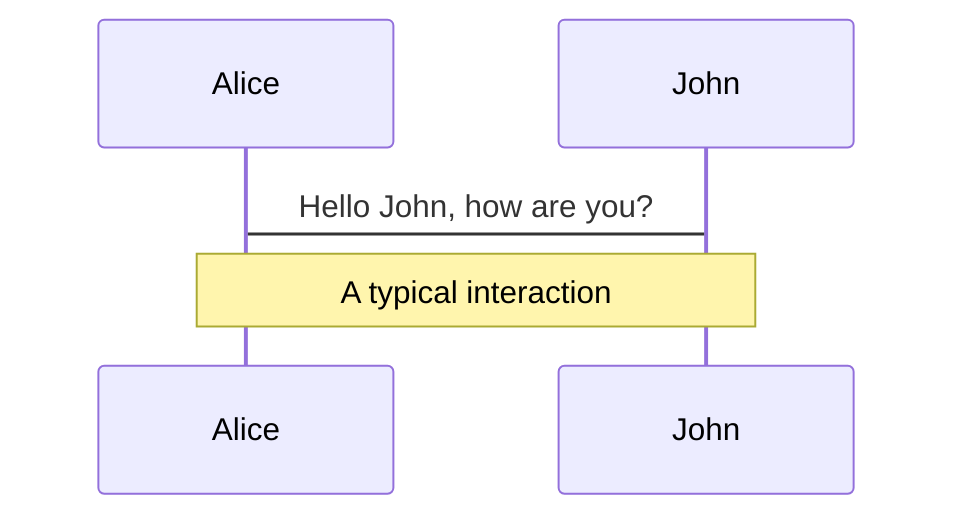
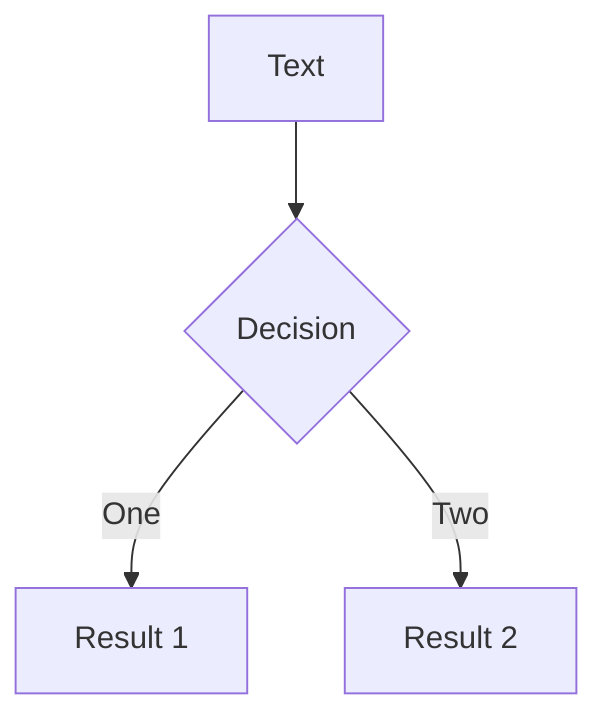
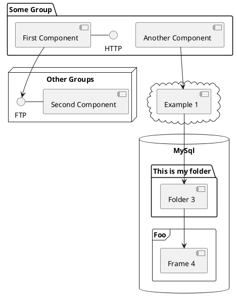

## DeepFlow: Deep Learning-Based Malware Detection by Mining Android Application for Abnormal Usage of Sensitive Data

By 

Sourena Khanzadeh

<!-- <div class="pt-12">
  <span @click="$slidev.nav.next" class="px-2 py-1 rounded cursor-pointer" hover="bg-white bg-opacity-10">
    Press Space for next page <carbon:arrow-right class="inline"/>
  </span>
</div>

<div class="abs-br m-6 flex gap-2">
  <button @click="$slidev.nav.openInEditor()" title="Open in Editor" class="text-xl slidev-icon-btn opacity-50 !border-none !hover:text-white">
    <carbon:edit />
  </button>
  <a href="https://github.com/slidevjs/slidev" target="_blank" alt="GitHub"
    class="text-xl slidev-icon-btn opacity-50 !border-none !hover:text-white">
    <carbon-logo-github />
  </a>
</div> -->

<!--
The last comment block of each slide will be treated as slide notes. It will be visible and editable in Presenter Mode along with the slide. [Read more in the docs](https://sli.dev/guide/syntax.html#notes)
-->

---
transition: fade-out
---

# Table of Contents

Here is the summary and structure of the presentation.

- 📝 Abstract
- 🎥 Introduction
- 📖 Background
- 📚 Literature Review **(Not Provided)**
- 📊 Methodology
- 📉 Evaluation
- 🔚 Conclusion

<br>
<br>

Visit the presentation https://sourenakhanzadeh.github.io/DeepFlow/

Read more about [Paper.](https://github.com/sourenaKhanzadeh/DeepFlow)

<!--
You can have `style` tag in markdown to override the style for the current page.
Learn more: https://sli.dev/guide/syntax#embedded-styles
-->

<style>
h1 {
  background-color: #2B90B6;
  background-image: linear-gradient(45deg, #4EC5D4 10%, #146b8c 20%);
  background-size: 100%;
  -webkit-background-clip: text;
  -moz-background-clip: text;
  -webkit-text-fill-color: transparent;
  -moz-text-fill-color: transparent;
}
</style>

<!--
Itroduce the project presentation
-->

---
transition: slide-up
---

# Abstract

Short summary of the paper.

### Keywords: <kbd>key</kbd>

The open nature of Android allows application developers to take full advantage of the system. While the flexibility is brought to developers and users, it may raise significant issues related to malicious applications. Traditional malware detection approaches based on signatures or abnormal behaviors are invalid when dealing with novel malware. To solve the problem, machine learning algorithms are used to learn the distinctions between malware and benign apps automatically. Deep learning, as a new area of machine learning, is developing rapidly as its better characterization of samples. We thus propose <kbd>DeepFlow</kbd>, a novel deep learning-based approach for identifying malware directly from the data flows in the Android application. We test <kbd>DeepFlow</kbd> on thousands of <kbd>benignware</kbd> and <kbd>malware</kbd>. The results show that <kbd>DeepFlow</kbd> can achieve a high detection <kbd>F1</kbd> score of 95.05%, outperforming traditional machine learning-based approaches, which reveals the advantage of deep learning technique in malware detection.

<!-- https://sli.dev/guide/animations.html#click-animations -->
<!-- 
<p v-after class="absolute bottom-23 left-45 opacity-30 transform -rotate-10">Here!</p> -->

---
layout: image-right
image: https://source.unsplash.com/collection/94734566/1920x1080
---

# Introduction
What is the problem?

<small>
  <ul>
    <li>Android devices have seen a rapid increase in popularity, with over 1.6 billion shipments in 2016 (Gartner, 2016).</li>
    <li>This popularity has led to the development of a vast Android application market with millions of apps available for download.</li>
    <li>However, due to the open nature of the Android platform, these markets are vulnerable to malware attacks (Sensor Tower, 2016).</li>
    <li>Malicious apps treat sensitive data differently from benign apps and can steal sensitive data, making it important to detect such apps.</li>
    <li>Previous approaches such as dynamic taint analysis have proven to be ineffective in detecting all sensitive data flows.</li>
  </ul>
</small>


<style>
.footnotes-sep {
  @apply mt-20 opacity-10;
}
.footnotes {
  @apply text-sm opacity-75;
}
.footnote-backref {
  display: none;
}
</style>

---
layout: image-left
image: https://source.unsplash.com/collection/94734566/1920x1080
transition: slide-up
---
# Introduction (cont.)
What is the solution?

<small>
  <ul>
    <li>Introducing <kbd>DeepFlow</kbd> a new Android malware detection tool that utilizes deep learning algorithms to detect and classify malware apps based on their data flow features.</li>
    <li>
      Deep learning algorithms can model high-level abstractions in data by using a deep graph with multiple processing layers.
    </li>
    <li>
      DeepFlow uses <kbd>FlowDroid</kbd> to extract data flows from thousands of benign and malicious apps and then applies <kbd>SUSI</kbd> technique to transform the feature granularity from method level to category level.
    </li>
    <li>
    A deep learning model is constructed using the extracted data flow features to automatically flag apps with suspicious data flow features.
    </li>
  </ul>
</small>

---
transition: slide-up
layout: two-cols
---

# Background

Taint Analysis

1. Sensitive Source (Source of user's sensitive information)
  ```java
  String phoneNumber = getPhoneNumber();
  ```
2. Taint Analysis (Track sensitive data throughout the code)
  ```java
  String message = "Phone Number: " + phoneNumber;
  String modifiedMessage = message + ", info.";
  ```
3. Sensitive Sink (Potential data leak point)
  ```java
  sendTextMessage(phoneNumber, modifiedMessage);
  ```

::right::



---
transition: slide-down
---

# Background (cont.)
Deep Learning

- Deep learning is a subset of machine learning that models high-level abstractions in data.
- It uses multiple processing layers with linear and non-linear transformations.

```python{all|1-4|6-13|15-19|all}
def initialize_network(input_size, hidden_size, output_size):
    network = create_network_structure(input_size, hidden_size, output_size)
    initialize_weights(network)
    return network

def train_network(network, training_data, learning_rate, epochs):
    for epoch in range(epochs):
        for data, target in training_data:
            input = preprocess_data(data)
            output = forward_pass(network, input)
            loss = calculate_loss(output, target)
            gradients = backpropagate(network, loss)
            update_weights(network, gradients, learning_rate)

def predict(network, input_data):
    input = preprocess_data(input_data)
    output = forward_pass(network, input)
    prediction = interpret_output(output)
    return prediction
```
---
transition: slide-right
---
# Background (cont.)
Traditional Approaches

- Require manual feature engineering.
- Often less accurate with large datasets.
- May struggle with unstructured data.

```python{all|1-3|5-9|11-14|all}
def preprocess_data(data):
    engineered_features = extract_manual_features(data)
    return engineered_features

def train_model(training_data, model_type, model_params):
    model = create_model(model_type, model_params)
    features, targets = separate_features_and_targets(training_data)
    model.fit(features, targets)
    return model

def predict(model, input_data):
    input_features = preprocess_data(input_data)
    prediction = model.predict(input_features)
    return prediction

```
---
transition: slide-left
---

# Background (cont.)
Deep Learning vs Traditional Approaches

<table class="small-font" style="width: 100%;height:250px;font-size:small">
  <tr>
    <th>Feature</th>
    <th>Traditional Approaches</th>
    <th>Deep Learning</th>
  </tr>
  <tr>
    <td>Feature Engineering</td>
    <td>Manual</td>
    <td>Automatic</td>
  </tr>
  <tr>
    <td>Performance with Large Datasets</td>
    <td>Often Less Accurate</td>
    <td>More Accurate</td>
  </tr>
  <tr>
    <td>Handling Unstructured Data</td>
    <td>May Struggle</td>
    <td>Better</td>
  </tr>
  <tr>
    <td>Model Complexity</td>
    <td>Generally Simpler</td>
    <td>More Complex (multiple layers)</td>
  </tr>
  <tr>
    <td>Training Time</td>
    <td>Often Faster</td>
    <td>Can be Slower (depends on model)</td>
  </tr>
  <tr>
    <td>Interpretability</td>
    <td>Generally More Interpretable</td>
    <td>Less Interpretable</td>
  </tr>
  <tr>
    <td>Applicability to Various Domains</td>
    <td>Domain-specific Feature Engineering</td>
    <td>More Adaptable to Different Domains</td>
  </tr>
</table>


<style>
.small-font {
  font-size: small;
}
table {
  font-family: Arial, sans-serif;
  border-collapse: collapse;
  width: 100%;
}
td, th {
  border: 1px solid #dddddd;
  text-align: left;
  padding: 8px;
}
tr:nth-child(even) {
  background-color: #f2f2f2;
}
</style>
---

# Components

<div grid="~ cols-2 gap-4">
<div>

You can use Vue components directly inside your slides.

We have provided a few built-in components like `<Tweet/>` and `<Youtube/>` that you can use directly. And adding your custom components is also super easy.

```html
<Counter :count="10" />
```

<!-- ./components/Counter.vue -->
<Counter :count="10" m="t-4" />

Check out [the guides](https://sli.dev/builtin/components.html) for more.

</div>
<div>

```html
<Tweet id="1390115482657726468" />
```

<Tweet id="1390115482657726468" scale="0.65" />

</div>
</div>

<!--
Presenter note with **bold**, *italic*, and ~~striked~~ text.

Also, HTML elements are valid:
<div class="flex w-full">
  <span style="flex-grow: 1;">Left content</span>
  <span>Right content</span>
</div>
-->


---
class: px-20
---

# Themes

Slidev comes with powerful theming support. Themes can provide styles, layouts, components, or even configurations for tools. Switching between themes by just **one edit** in your frontmatter:

<div grid="~ cols-2 gap-2" m="-t-2">

```yaml
---
theme: default
---
```

```yaml
---
theme: seriph
---
```


</div>

Read more about [How to use a theme](https://sli.dev/themes/use.html) and
check out the [Awesome Themes Gallery](https://sli.dev/themes/gallery.html).

---
preload: false
---

# Animations

Animations are powered by [@vueuse/motion](https://motion.vueuse.org/).

```html
<div
  v-motion
  :initial="{ x: -80 }"
  :enter="{ x: 0 }">
  Slidev
</div>
```

<div class="w-60 relative mt-6">
  <div class="relative w-40 h-40">
    
    
    
  </div>

  <div
    class="text-5xl absolute top-14 left-40 text-[#2B90B6] -z-1"
    v-motion
    :initial="{ x: -80, opacity: 0}"
    :enter="{ x: 0, opacity: 1, transition: { delay: 2000, duration: 1000 } }">
    Slidev
  </div>
</div>

<!-- vue script setup scripts can be directly used in markdown, and will only affects current page -->
<script setup lang="ts">
const final = {
  x: 0,
  y: 0,
  rotate: 0,
  scale: 1,
  transition: {
    type: 'spring',
    damping: 10,
    stiffness: 20,
    mass: 2
  }
}
</script>

<div
  v-motion
  :initial="{ x:35, y: 40, opacity: 0}"
  :enter="{ y: 0, opacity: 1, transition: { delay: 3500 } }">

[Learn More](https://sli.dev/guide/animations.html#motion)

</div>

---

# LaTeX

LaTeX is supported out-of-box powered by [KaTeX](https://katex.org/).

<br>

Inline $\sqrt{3x-1}+(1+x)^2$

Block
$$
\begin{array}{c}

\nabla \times \vec{\mathbf{B}} -\, \frac1c\, \frac{\partial\vec{\mathbf{E}}}{\partial t} &
= \frac{4\pi}{c}\vec{\mathbf{j}}    \nabla \cdot \vec{\mathbf{E}} & = 4 \pi \rho \\

\nabla \times \vec{\mathbf{E}}\, +\, \frac1c\, \frac{\partial\vec{\mathbf{B}}}{\partial t} & = \vec{\mathbf{0}} \\

\nabla \cdot \vec{\mathbf{B}} & = 0

\end{array}
$$

<br>

[Learn more](https://sli.dev/guide/syntax#latex)

---

# Diagrams

You can create diagrams / graphs from textual descriptions, directly in your Markdown.

<div class="grid grid-cols-3 gap-10 pt-4 -mb-6">







</div>

[Learn More](https://sli.dev/guide/syntax.html#diagrams)

---
src: ./pages/multiple-entries.md
hide: false
---

---
layout: center
class: text-center
---

# Learn More

[Documentations](https://sli.dev) · [GitHub](https://github.com/slidevjs/slidev) · [Showcases](https://sli.dev/showcases.html)
